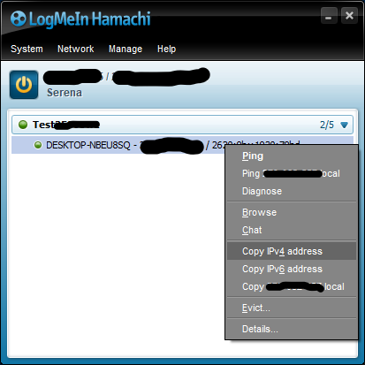
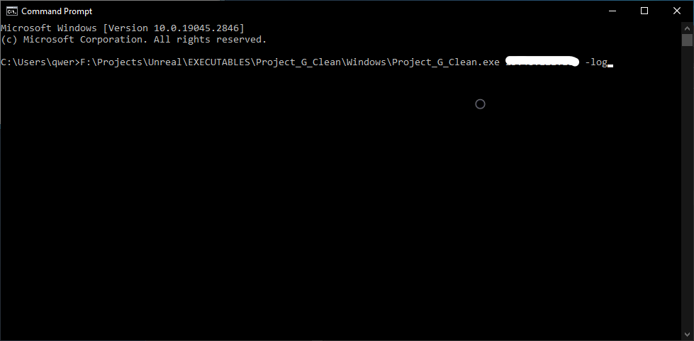
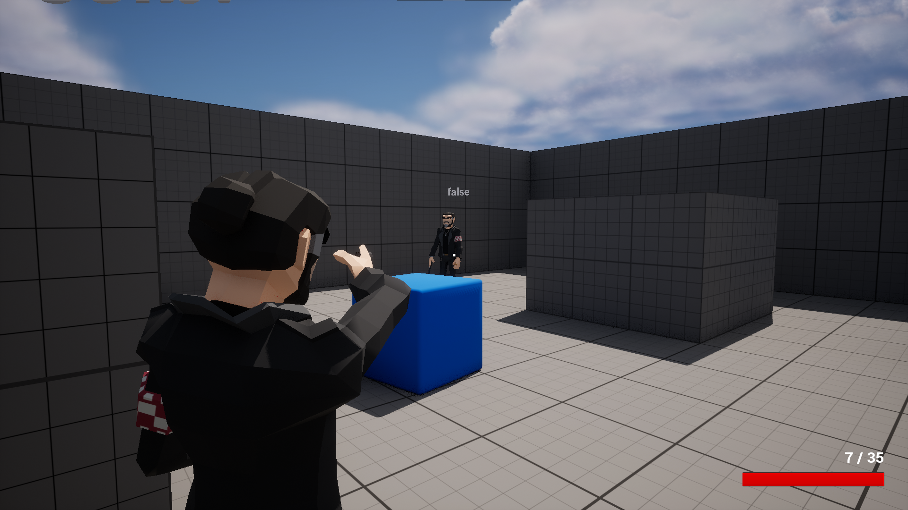

    
 지금 EOS와 스팀을 연동하는 부분에 문제가 있어 해결중이니 그동안 이 방법을 써 주시기 바랍니다.    
    
1. [하마치](https://www.vpn.net/)(또는 비슷한 개인 vpn) 설치

2. 하마치에서 서버를 열고 연결하기(최대 5명)    

3. IPv4 주소 복사    


4. cmd 창 열기(윈도우 키 누르고 'command' 검색) 하고 명령어 입력하기: ``` <game location> <ipv4 address> -log ```    
(game location 과 ipv4 address는 개인별로 맞춰서 변경하기)    
    
예시:


5. 컴퓨터 사양에 따라 로딩 속도가 다를 수 있으니 비상식적으로 오래 걸리지 않는 한 조금만 기다려 주시기 바랍니다. 곧 연결됩니다.    
