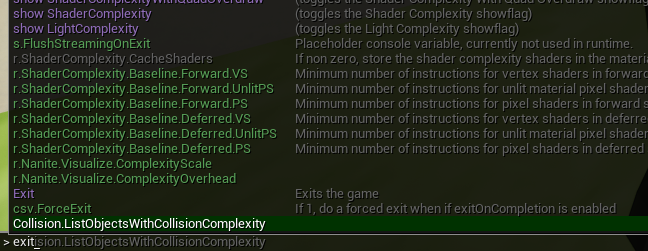

+++
title= "Instructions"
weight= 3
date= 2023-04-22T06:15:40+09:00
draft= false
+++

1. How to play
   * Controls
     * W, S, A, D to move
     * Space to jump
     * Move mouse to look around
     * Left click to shoot
     * Right click to aim(zoom in)
     * Esc to open menu, etc...

2. How to exit
   * proper exit menu will be implemented later
   * press ``` ` ``` key to open console
   * type ``` exit ``` and press enter    

     
1. How to show FPS counter (for contributing & reporting)
   * press ``` ` ``` key to open console
   * type ``` stat fps ``` and press enter

   * FPS counter should appear on right side of screen
